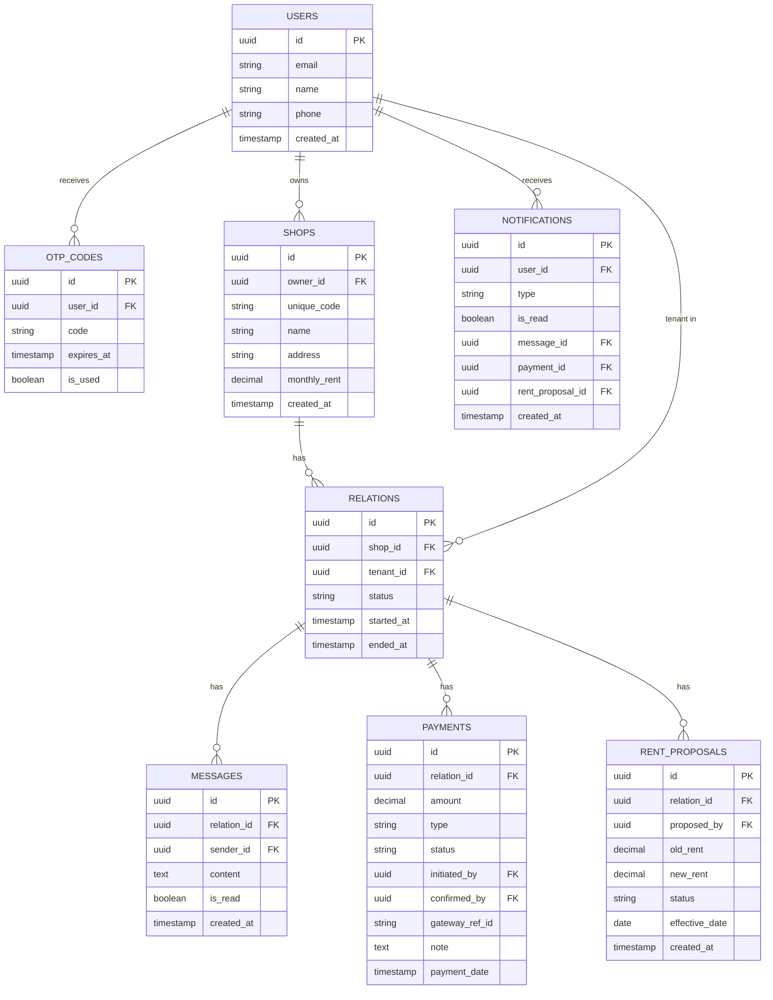

# 🏪 Rental Management App

A full-stack web application to manage rental relationships between **Owners** and **Tenants**.

## ✨ Core Features

- 📧 Email OTP based registration & login (no passwords)
- 🏪 Owners create Shops with unique codes; Tenants search and request to join
- 🤝 One active Tenant per Shop at a time (exclusive Relations)
- 💬 Real-time 1-on-1 chat per Relation
- 💰 Payment ledger — online (Razorpay) + cash with dual-approval
- 📈 Rent increase proposal system with tenant accept/reject

## 🛠️ Tech Stack

| Layer | Technology | Reason |
|---|---|---|
| Frontend | Next.js (React) | SSR, file-based routing, great for dashboards |
| Backend | Node.js + Express | Non-blocking I/O, perfect for real-time features |
| Database | PostgreSQL | Relational integrity for complex relations and ledgers |
| Real-time | Socket.io | WebSocket chat built on top of Express |
| Payments | Razorpay | India-focused payment gateway |
| Auth | Custom Email OTP | No third-party lock-in, learning-focused |

## 🗄️ Database ER Diagram



## 🗓️ Sprint Roadmap

| Sprint | Feature | Status |
|---|---|---|
| Sprint 1 | Project setup + DB migrations + Email OTP Auth | ✅ Complete|
| Sprint 2 | Shop creation + Search + Join Request flow | ✅ Complete|
| Sprint 3 | Real-time chat per Relation | ⏳ Pending |
| Sprint 4 | Payment ledger (cash + online) | ⏳ Pending |
| Sprint 5 | Rent increase proposal flow | ⏳ Pending |
| Sprint 6 | Notification system | ⏳ Pending |
| Sprint 7 | UI polish + Deployment | ⏳ Pending |

## 🚀 Getting Started (Local Setup)

### Prerequisites
- Node.js v18+
- PostgreSQL 15+

### Backend
```bash
cd backend
npm install
cp .env.example .env
npm run dev
```

### Frontend
```bash
cd frontend
npm install
npm run dev
```
